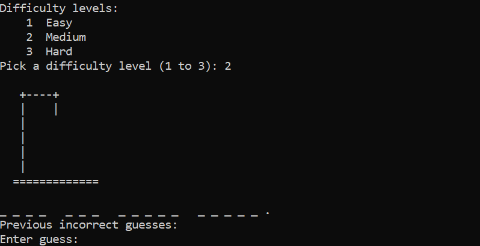
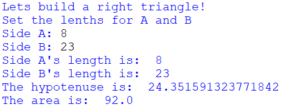

Portfolio
=========

Programming Projects
--------------------

*For access to my private project repositories, please [email me](mailto:creigcooke@gmail.com?subject=GitHub%20Access) with the subject line, GitHub Access.

---
### [Hangman Game | CSCI 235](project1)

---
### [Right Triangle | CSCI 301](Project2)

Ethics Papers
-------------

### [Ethics of Advertising and Ad-block](/pdf/Ethics_Paper.pdf)

-   **Class: CSCI 235**  
-   **Grade: B**

Page template forked from <a href="https://github.com/csu-cs/csci-portfolio">CSU-CS</a>

<!-- Remove above link if you don't want to attributive -->
